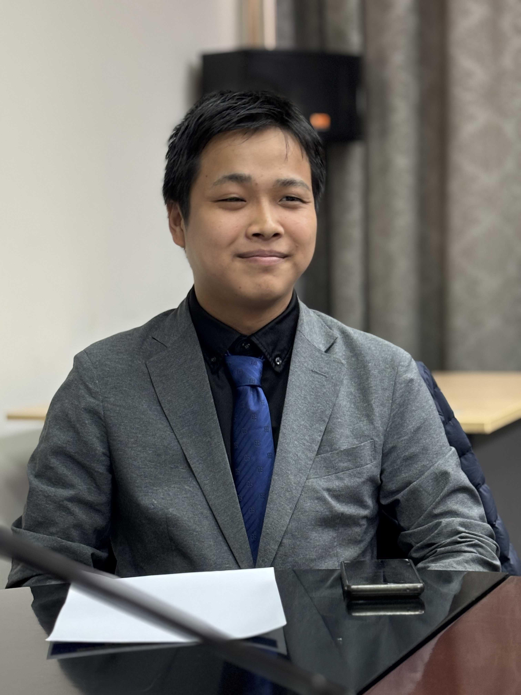

# 秦 幸生（Kosei Noah HATA）

_最終更新: 2026-05-17_

## プロフィール
九州大学所属。　趣味は旅行と電子工作です。
気の向くままに開発をしています。
最近は人間をおおきくしようと試みています。

## スキル
- Language: 日・英・中・露
- Tech: TypeScript, React, Node.js, Python/Pytorch, tensorflow, C/C++
- Infrastracture/Tooling: AWS, Azure, Git, GitHub, Figma, Kicad, 3Dcad, Davinci Resolve

## 実績・採択
- 第11回全国小中学生ロボット選手権　中学生部門　県代表
- PMCO 2019 Spring Split 11th
- AQL2021 ジュニアの部 全国大会進出
- 2022年度 エコノミクス甲子園 全国大会出場
- 第12期　半田スカラシップ奨学生
- 2024/2025 九州大学QREC IB(アイディア・バトル) 採択
- 令和7年度 福岡県糸島市学生アイディア社会実装補助金　採択
- 福岡未踏 第3期 Solve 採択
- Tokyo BCI Hackathon 2025 優勝
- 2025年度 九州大学フォーラム　「KYUDAI NOW」in モンゴル・ウランバートル ポスター発表
- 2025年度 九州大学 KAPPAプログラム 採択
- 2026年度 日本財団HUMAIプログラム　採択
- 2026年度 九州大学QREC 九創会刮目基金奨励金　採択
- 2026年度　未踏ターゲット事業(リザバーコンピューティング) 採択

## 所属
- 九州大学
- モリハタ化学工業合同会社　代表
- 株式会社basiq 役員/技術開発部長

## Contact
XのDMからお願いいたします。
